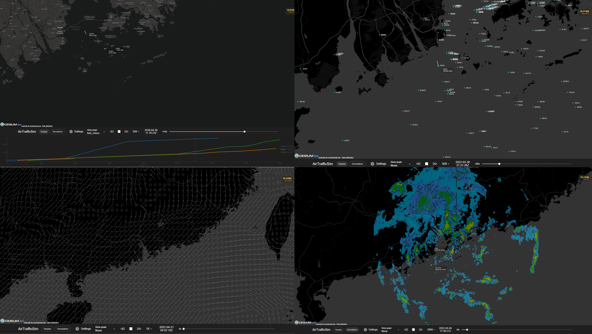

# AirTrafficSim

AirTrafficSim is a web-based air traffic simulation software written in Python and Javascript. It is designed to visualize historical and simulated flight data and perform microscopic studies of air traffic movement with the integration of a historical weather database. It aims to assist users to evaluate the performance of ATM algorithms.

AirTrafficSim is open-sourced at [https://github.com/HKUST-OCTAD-LAB/AirTrafficSim](https://github.com/HKUST-OCTAD-LAB/AirTrafficSim).

## Features

- Replay historical flights with user-provided data (e.g. from FlightRadar 24)
- Air traffic simulation using [BADA 3.15 performance data](https://www.eurocontrol.int/model/bada) and [OpenAP](https://github.com/TUDelft-CNS-ATM/openap)
- Navigation data simulation and visualization from [x-plane 11](https://developer.x-plane.com/docs/data-development-documentation/)
- Autopilot and Flight Management System simulation
- ATC commands (e.g. holding, vectoring, and direct to) simulation
- Simulation and visualisation with weather data from [ECMWF ERA5](https://cds.climate.copernicus.eu/cdsapp#!/dataset/reanalysis-era5-pressure-levels?tab=overview) and custom radar image (HKO 256km radar images)
- Aircraft is controlled with  an API interface to simulate ATC interaction

## Usage

> **[Tactical routing for air transportation in HKIA terminal manuevering area](https://repository.hkust.edu.hk/ir/bitstream/1783.1-122610/1/122610-1.pdf)**
> 
> The 26th HKSTS International Conference, 2022
> 
> Chris HC. NGUYEN, Go Nam LUI, Ka Yiu HUI, and Rhea P. LIEM

<iframe width="560" height="315" src="https://www.youtube.com/embed/Vq62IG-sNQY" title="YouTube video player" frameborder="0" allow="accelerometer; autoplay; clipboard-write; encrypted-media; gyroscope; picture-in-picture" allowfullscreen></iframe>

