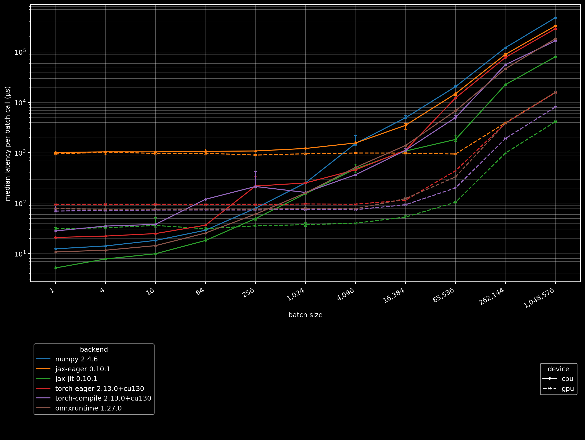
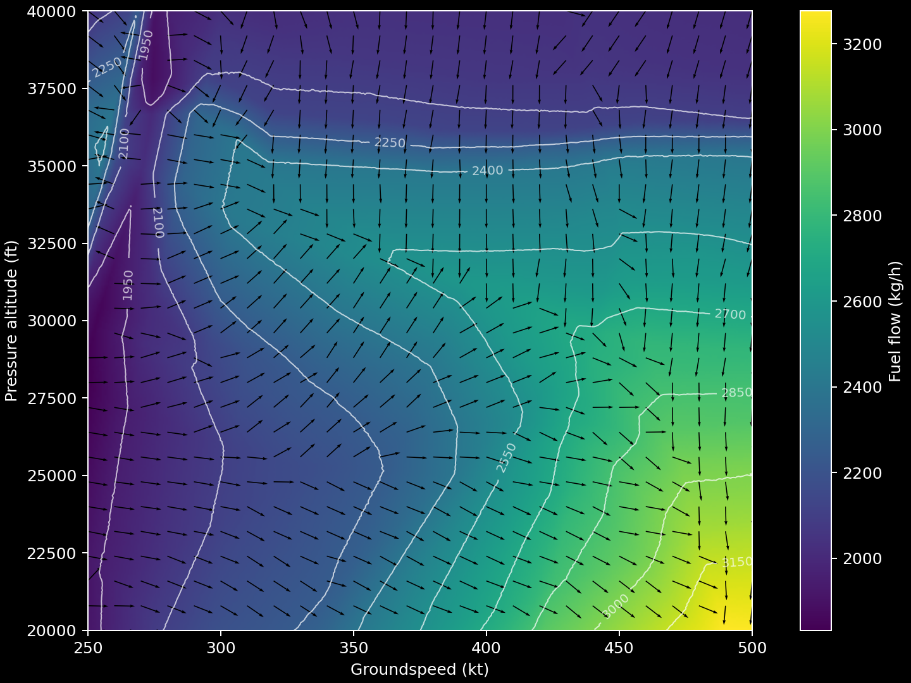

# Fuel Estimation (Acropole)

Acropole is a neural network that estimates the fuel flow given an aircraft state vector and its parameters (see [Jarry et al. (2024)](https://doi.org/10.13140/RG.2.2.23229.27360)).

Unlike the [upstream repository](https://github.com/DGAC/Acropole) which uses ONNX, this implementation is intentionally backend agnostic. You can use pure numpy, or optionally use JAX/Torch for GPU acceleration.

## Download assets

The model weights and aircraft database are distributed separately (not bundled in the library) because it is licensed under the GNU Affero General Public License v3.0. Download them manually:

```sh
uv add "aerocore[cli,httpx]"
# by default, this is downloaded to the cache directory (xdg cache home on Linux/Mac)
uv run aerocore data-acropole-sync
```

## Numpy Backend

To run with the default numpy backend:

```python
--8<-- "examples/acropole_numpy.py:input0"
```

```text
--8<-- "examples/acropole_numpy.py:output0"
```

!!! note "Inputs"

    Trajectory arrays must have identical shapes and store time along the final axis. Aerocore does not broadcast, resample, smooth or interpolate trajectory inputs.

    The paper reports using one-second QAR samples and says vertical speed and true airspeed were smoothed with a Savitzky-Golay filter, but does not specify a filter window. The upstream implementation later recommended approximately four-second sampling. Callers are responsible for any resampling, interpolation, and smoothing.

Under the hood, it duplicates the parameters in the given [`AcropoleAircraft`][aerocore.acropole.AcropoleAircraft] across the batch, resulting in an array of shape `(12, T)`. But in cases where you want heterogenous aircraft types, you should construct the input arrays yourself and use lower level functions:

```python
--8<-- "examples/acropole_mixed_aircraft.py:input0"
```

```text
--8<-- "examples/acropole_mixed_aircraft.py:output0"
```

## Other numerical backends

Here is a benchmark of Acropole. On my machine `jax.jit` achieves 2-4x speedup compared to `onnxruntime-gpu` depending on the batch size. Note that input arrays are assumed to be on the device the model is located, so GPU benchmarks do not include the CPU-GPU synchronisation latency.



To use JAX JIT on GPU, use [`tree_map()`][aerocore.utils.tree_map] to move the model to another device:

```sh
uv add "aerocore[jax_gpu,matplotlib]"
```

```python
--8<-- "examples/acropole_jax_gpu.py:input0"
```

```text
--8<-- "examples/acropole_jax_gpu.py:output0"
```

A toy example of using `jax.value_and_grad` to show the direction of the steepest increase in fuel flow over a grid of altitude and groundspeed, for a steady, level, unaccelerated A320 flight at 65 tonnes:

<details>
    <summary>code</summary>

    ```python
    --8<-- "examples/acropole_jax_gradient.py:input0"
    ```
</details>



It supports PyTorch CUDA too:

```sh
uv add "aerocore[torch_gpu]"
```

```python
--8<-- "examples/acropole_torch_gpu.py:input0"
```

```text
--8<-- "examples/acropole_torch_gpu.py:output0"
```

Any Array API compatible interface is also supported.

## Development

```sh
./scripts/acropole_prepare_model.py build \
  --output-dir dist/acropole-v0.1.0

# test the published assets
uv run pytest -q tests/test_acropole.py

./scripts/acropole_benchmark.py \
  --output /tmp/acropole-benchmark.jsonl \
  --plot docs/assets/img/acropole-benchmark.png
```
